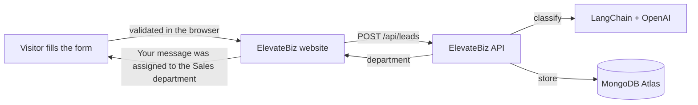

# ElevateBiz — AI Automation & Marketing Landing Page

Bilingual (English / Spanish) marketing site for **ElevateBiz**, an agency that helps small and medium businesses automate customer service, lead handling, and marketing with AI.

**Live site:** [elevatebiz.ai](https://elevatebiz.ai)
**Backend:** [ElevateBiz API](https://github.com/AntonioGlUs/elevatebiz-api) (FastAPI + LangChain + MongoDB)

## How the contact form works

The contact form is connected to the ElevateBiz API, which classifies every request with AI:



1. The visitor fills out the form. Name and email are validated in the browser first, with inline, accessible error messages.
2. The site sends the lead to the API at `https://api.elevatebiz.ai/api/leads`.
3. The API uses AI to pick the **department** (sales, support, partnerships), set an **urgency**, and write a short **summary**, then saves the lead in MongoDB.
4. The site tells the visitor which department their message was assigned to. Urgency and summary stay internal for the team.

## Tech stack

- [Next.js 14](https://nextjs.org) (App Router) with static export
- React 18 + TypeScript
- CSS Modules (one stylesheet per component)
- [Three.js](https://threejs.org) for the interactive 3D robot
- Google Fonts (Fraunces, Karla)
- No UI framework: layout, styles, and animations are hand-built

## Features

- **AI-powered contact form.** Connected to the ElevateBiz API, which classifies each request by department and urgency (see above).
- **Accessible form validation.** Inline error messages in EN/ES, `aria-invalid` / `aria-describedby` for screen readers, and focus moves to the first invalid field.
- **EN / ES language toggle.** All copy lives in one typed content file (`lib/content.ts`), so each section renders in either language.
- **Interactive 3D robot.** Built with Three.js from simple shapes; its head and eyes follow the mouse. Three.js is loaded on demand and only animates while on screen.
- **AI chatbot.** An n8n-powered chat widget (`Chatbot.tsx`) answers visitors' questions.
- **Animated WhatsApp demo.** A scripted conversation plays message by message with a typing indicator, showing how an AI assistant answers a customer.
- **Lead-routing diagram.** An animated diagram shows incoming leads being routed to the right team member by specialty.
- **Scroll-driven interactions:**
  - Navbar that shrinks on scroll
  - Hero entrance animation
  - Stats that count up when they come into view
  - Sections that reveal as you scroll
- **Services carousel and client logo marquee**, plus hover effects on service cards.
- **FAQ, team, and contact sections**, plus a call-to-action band with a click-to-call phone number.
- **Optimized images.** All images are WebP, sized for their display size, with lazy loading below the fold.
- **Static export.** `next build` outputs plain HTML/CSS/JS to `out/`, so the site runs on any static or shared hosting (no Node.js server needed).

## Getting started

Requires Node.js 18+.

```bash
npm install
npm run dev
```

Open [http://localhost:3000](http://localhost:3000).

The contact form calls the production API by default. To test against a local copy of the API, change `API_URL` in `app/components/constants.ts` to `http://localhost:8000`.

### Production build

```bash
npm run build
```

The static site is generated in `out/` and can be uploaded to any web host.

## Project structure

```
app/
  layout.tsx       — metadata, fonts, favicon
  page.tsx         — page layout: the order of the sections
  globals.css      — base styles and responsive overrides
  components/      — one component per section, each with its own .module.css
    ContactForm.tsx  — form, validation, and the call to the API
    Robot3D.tsx      — interactive Three.js robot
    constants.ts     — API URL, preview-mode switch, and shared links
lib/
  content.ts       — EN/ES copy, stats, FAQ, team, navigation, chat script
public/
  images/          — WebP images and logo
  coming-soon/     — placeholder page for links that aren't live yet
```

## Roadmap

- [x] Connect the contact form to the AI lead classification API
- [x] Embed an AI chat widget
- [ ] Replace placeholder client logos with real ones
- [ ] Cloudflare Turnstile on the contact form (bot protection)
